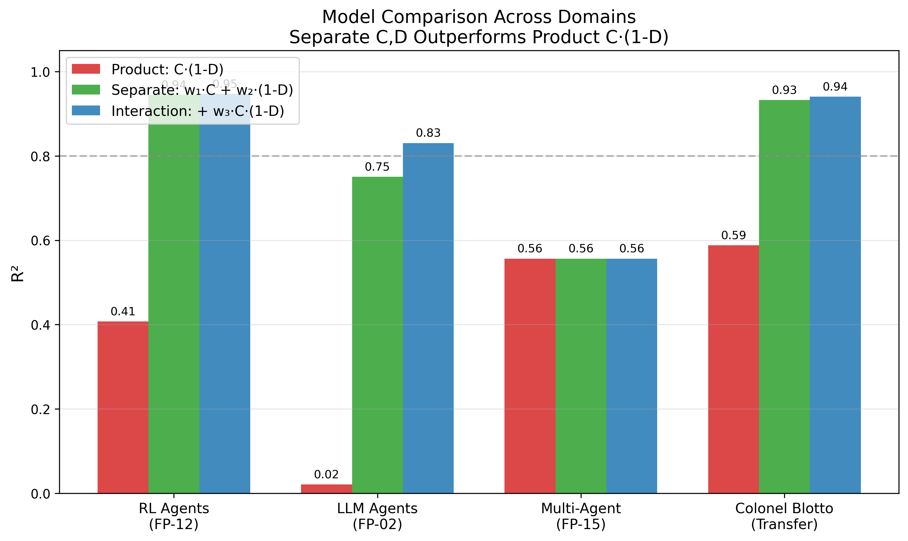

# Defense Difficulty Decomposes Additively — Controllability and Observability Are Independent, Not Multiplicative

**Attacker controllability (C) and defender observability (D) predict attack success independently (R²=0.76-0.93), not as the intuitive product C·(1-D) (R²=0.34). Security systems are observability-limited; game-theoretic systems are controllability-limited.**

[](LICENSE)
[](https://www.python.org/downloads/)
[](tests/)



## Key Results

| Finding | Metric | Domains |
|---|---|---|
| Separate C,D outperforms product C·(1-D) | R²=0.76 vs R²=0.34 (security); R²=0.93 vs R²=0.59 (games) | 4 domains |
| Security systems are observability-limited | D contribution: R²=0.69 vs C contribution: R²=0.03 (RL agents) | RL, multi-agent |
| Game-theoretic systems are controllability-limited | C contribution: R²=0.91 vs D contribution: R²=0.02 (Blotto) | Colonel Blotto |
| Multiplicative model consistently fails | R²=-1.92 to R²=0.16 across all domains (worse than predicting the mean) | All 4 domains |
| Architectural observability overstates effective observability | Capability-scoped trust: D_architectural=0.8, D_effective≈0.1 | Multi-agent cascades |

## The Finding

We pre-registered a controllability bound using the product of C and (1-D). The data refuted the product structure.

The better model separates the terms: `E[attack_success] ≈ w₀ + w₁·C + w₂·(1-D)`

The weights are domain-dependent. Security systems (reinforcement learning agents, LLM agents, multi-agent cascades) have w₂ >> w₁. Adding monitoring helps more than restricting attacker access. Game-theoretic systems (Colonel Blotto) have w₁ >> w₂. Resource control matters more than information advantage.

This asymmetry was not predicted. The pre-registration forced testing both models. The refutation produced a stronger finding than confirmation would have.

## Quick Start

```bash
git clone https://github.com/rexcoleman/controllability-bound.git
cd controllability-bound
pip install -e .
python -m pytest tests/ -v          # 15 tests
bash reproduce.sh                    # full reproduction
```

**Score your own system:**

```bash
# Quick single-channel check
controllability-scorer quick -c 0.5 -d 0.0 --name "reasoning_chain"
# Channel: reasoning_chain
#   C=0.5, D=0.0
#   Score: 0.775 (CRITICAL)

# Full system from JSON spec
controllability-scorer example > my_system.json  # generate template
controllability-scorer score my_system.json      # score it
```

## Methodology

Pre-registered 6 hypotheses across 3 competing models (additive product, multiplicative, additive with interactions). Operational definitions for C and D locked before fitting. Validated across 4 structurally diverse domains:

1. **Reinforcement learning agents**: observation perturbation vs reward poisoning, 10 data points
2. **LLM-based agents**: 5 input channels with varying controllability and observability, 5 data points
3. **Multi-agent cascades**: trust model comparison across implicit, capability-scoped, and zero-trust, 9 data points
4. **Colonel Blotto games** (transfer test): 50 conditions, 25,000 games, 5 seeds

Read the full methodology at [rexcoleman.dev](https://rexcoleman.dev). Experimental design in [EXPERIMENTAL_DESIGN.md](EXPERIMENTAL_DESIGN.md). Full results in [FINDINGS.md](FINDINGS.md).

## Figures

| Figure | What It Shows |
|---|---|
| [Model Comparison](figures/fig1_model_comparison.png) | R² by domain for product, separate, and interaction models |
| [Factor Dominance](figures/fig2_factor_dominance.png) | C vs D contribution by domain — the asymmetry |
| [Blotto Transfer](figures/fig3_blotto_transfer.png) | Win rate vs controllability at different observability levels |
| [Ablation Waterfall](figures/fig4_ablation_waterfall.png) | Component contributions to model fit |

## Hypothesis Resolutions

| Hypothesis | Verdict |
|---|---|
| H-1: Product bound R²>0.8 in 3+ domains | **REFUTED** — max 0.56, led to better separate model |
| H-2: Additive beats multiplicative | **SUPPORTED** — 3/3 domains |
| H-3: Bound beats single-feature | **REFUTED** — (1-D) alone competitive in RL; C alone in Blotto |
| H-4: Blotto transfer within 15% | **PARTIAL** — R²=0.93 but 26.6% mean error |
| H-5a: Interaction terms matter somewhere | **SUPPORTED** — +0.49 in LLM, +0.27 in RL |
| H-5: Tightness 1.0-3.0x | **SUPPORTED** — 2.22x mean |

2 supported, 2 refuted, 2 partial. The refutations produced the primary contribution.

## Citation

```bibtex
@misc{coleman2026controllability,
  title={Defense Difficulty Decomposes Additively Into Controllability and Observability},
  author={Coleman, Rex},
  year={2026},
  url={https://github.com/rexcoleman/controllability-bound}
}
```

## License

MIT. See [LICENSE](LICENSE).
